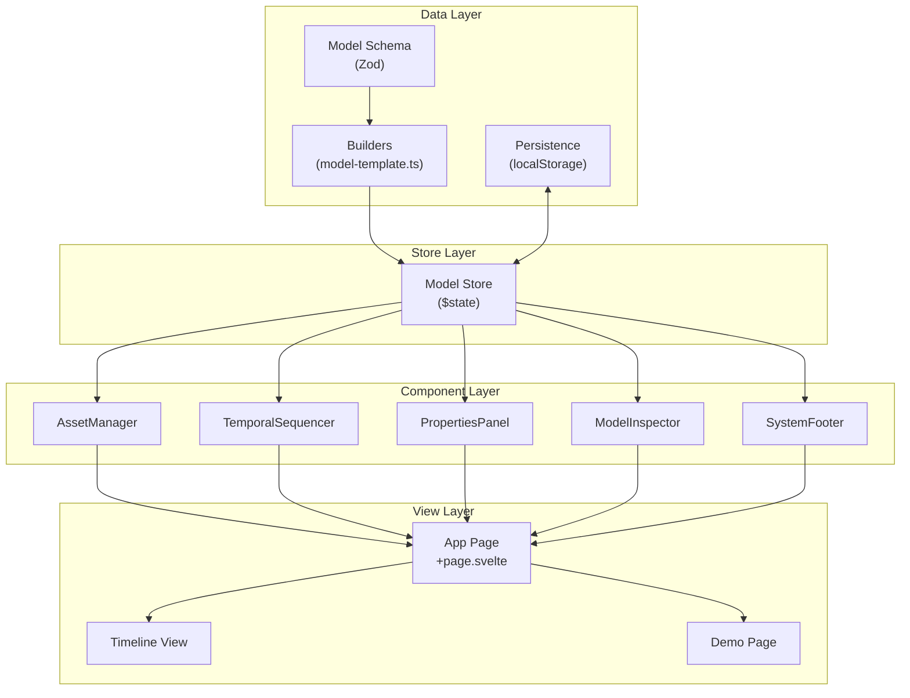
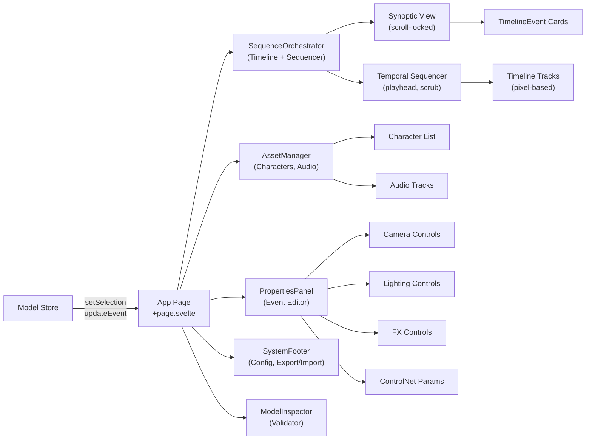
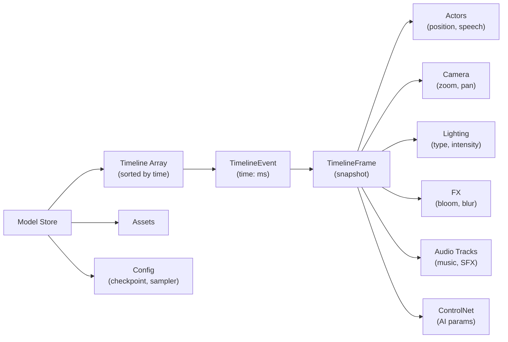
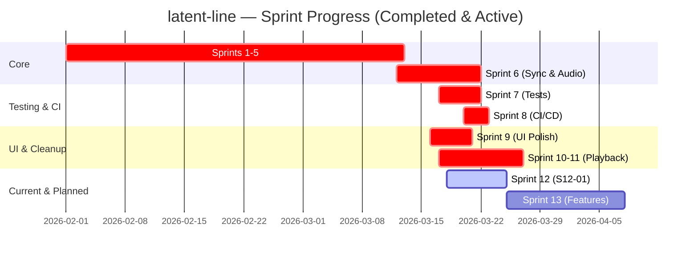
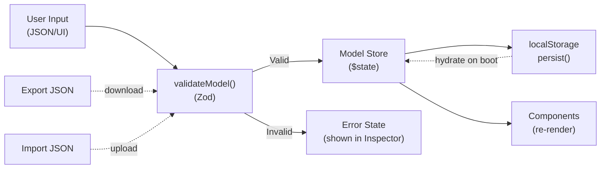

# Latent-line Project Overview

[](https://github.com/medyll/latent-line/actions/workflows/ci.yml)

**Latent-line** is a SvelteKit 5 + Vite SPA for orchestrating **AI-driven story/scene production** with interactive timeline editing, asset management, and real-time model inspection.

## 🎯 Purpose

Create and manage complex animated narratives by:

- Defining character assets with prompts, references, and outfit variations
- Building timeline events with precise timing, camera movements, lighting, and effects
- Configuring checkpoint models, samplers, seeds, and TTS engines
- Exporting narratives for downstream video/animation generation

## 🏗️ Architecture

```
src/
├── lib/
│   ├── model/                  # Data layer (pure, testable)
│   │   ├── model-types.ts      # Type definitions (Story, Character, Timeline, etc.)
│   │   ├── model-template.ts   # Zod validation schemas & default builders
│   │   ├── model-example.ts    # Concrete example story
│   │   ├── model-story-example.ts # Full-featured example (Goliath Spring)
│   │   ├── index.ts            # Barrel export for types & functions
│   │   └── model-template.test.ts # Unit tests for validation
│   │
│   └── components/
│       ├── app/                # Application-specific components
│       │   ├── Timeline.svelte  # Timeline event editor
│       │   ├── AssetManager.svelte # Character/environment/audio CRUD
│       │   ├── PropertiesPanel.svelte # Contextual property editor
│       │   ├── TimelineEvent.svelte # Individual event card
│       │   ├── SequenceOrchestrator.svelte # Event sequencing UI
│       │   ├── ModelInspector.svelte # Model validation inspector
│       │   ├── SystemFooter.svelte # Footer controls
│       │   ├── ImportModal.svelte # JSON import with validation
│       │   ├── ExportModal.svelte # Multi-format export
│       │   ├── index.ts # Barrel export for app components
│       │   └── [more...].svelte
│       │
│       ├── application/        # Layout components (sidebar, header)
│       └── ui/                 # shadcn-svelte primitives (read-only)
│
├── routes/
│   ├── +page.svelte            # Home / landing
│   ├── /app/+page.svelte       # Main editor
│   ├── /timeline/+page.svelte  # Timeline-focused view
│   ├── /demo/+page.svelte      # Demo page
│   └── /demo-model/+page.svelte # Model demo
│
├── utils/
│   ├── import-parser.ts        # Import validation & merge logic
│   ├── export-*.ts             # Export format handlers
│   └── [more...].ts
│
└── [other files]

docs/                           # User documentation
├── USER_GUIDE.md               # End-user guide
├── API.md                      # REST API reference
└── MODEL_SCHEMA.md             # Data model reference

e2e/                           # Playwright end-to-end tests
bmad/                          # Project metadata & docs
└── artifacts/
    └── audit-*.md             # Audit reports
```

### Data Flow

```
Model (Zod schema)
  ↓
model-template.ts (validation, builders)
  ↓
Components ($state stores)
  ↓
UI (Svelte 5 reactivity)
```

---

## 📈 Diagrams

### 1. System Architecture



### 2. Component Hierarchy & Data Flow



### 3. Timeline Conceptual Model



### 4. Feature Roadmap (Sprints)



### 5. Data Validation Pipeline



---

## 📊 Data Model

### Core Types

**Model** – The root narrative document

```typescript
interface Model {
	project: Project; // Resolution, FPS, name
	assets: Assets; // Characters, environments, audio
	timeline: TimelineEvent[]; // Array of scene events
	config: Config; // Checkpoint, sampler, seed, TTS engine
}
```

**TimelineEvent** – A single scene moment

```typescript
interface TimelineEvent {
	time: number; // Millisecond offset
	frame: TimelineFrame; // What happens at this time
}
```

**TimelineFrame** – Snapshot of scene state

```typescript
interface TimelineFrame {
	actors?: Actor[]; // Character positions, speech, actions
	camera?: Camera; // Zoom, pan, tilt
	lighting?: Lighting; // Type, intensity
	fx?: FX; // Bloom, motion blur
	controlnet?: ControlNet; // Control net parameters
	audio_tracks?: AudioTrack[]; // Background music, SFX
	audio_reactive?: AudioReactive; // Audio-driven param animation
}
```

### Validation

All models are validated against `modelSchema` (Zod) which enforces:

- Character IDs must be unique and reference valid characters in assets
- Audio asset URLs must be absolute URLs or valid local filenames
- **Path traversal prevention** (rejects `..`, null bytes)
- Camera zoom ranges, lighting intensity 0-1, etc.
- Timeline events sorted by time

---

## 🔧 Key Components

### Timeline.svelte

Renders a horizontal timeline with zoom controls. Converts TimelineEvent array to displayable cards. Supports scrubbing and selection.

### AssetManager.svelte

Lists characters, environments, and audio assets. Shows empty states. **Now uses `structuredClone()` to prevent mutations.**

### PropertiesPanel.svelte

**Fully typed** with `TimelineEvent` input. Displays camera, lighting, FX, and ControlNet properties for the selected event.

### SequenceOrchestrator.svelte

Orchestrates timeline event sequences. Includes **play/pause/stop** controls with an animated playhead at 24fps. Click anywhere on the track to scrub. Keyboard: `Space` = play/pause, `Escape` = stop.

### SystemFooter.svelte

Config controls (checkpoint, sampler, seed, TTS). **Export JSON** downloads the validated model. **Import JSON** loads and validates a model file in-place via Zod.

### ModelInspector.svelte

Live model inspection overlay. Click the `⌥` button (bottom-right) to open. Shows project info, asset counts, timeline events, and raw JSON. Validate button runs Zod against the current model.

---

## 📚 Documentation

### User Documentation

| Document | Description |
|----------|-------------|
| [**User Guide**](./docs/USER_GUIDE.md) | Complete user manual with tutorials |
| [**API Reference**](./docs/API.md) | REST API documentation |
| [**Model Schema**](./docs/MODEL_SCHEMA.md) | Data model reference |

### Quick Reference

**Import/Export Formats:**

| Format | Extension | Use Case |
|--------|-----------|----------|
| YAML | `.yaml` | Human-readable config |
| JSON-LD | `.jsonld` | Semantic web, RDF |
| CSV | `.csv` | Spreadsheet import |
| JSON | `.json` | Data interchange |
| PDF | `.pdf` | Storyboard printing |
| ZIP | `.zip` | Complete archive |

**Keyboard Shortcuts:**

| Shortcut | Action |
|----------|--------|
| `Ctrl+Z` / `Ctrl+Y` | Undo / Redo |
| `Space` | Play/Pause |
| `Ctrl+I` | Model Inspector |
| `Ctrl+E` | Export Modal |

---

## 🧪 Testing

- **Unit tests**: 218 tests across model validation, components, and input validation
  - Run: `npm run test:unit`
  - Coverage report: `npm run test:unit:coverage`

- **E2E tests**: `e2e/` (Playwright) — 12+ scenarios
  - Run: `npm run test:e2e`
  - Covers: app boot, timeline load, asset CRUD, event selection, PropertiesPanel editing

- **Visual regression**: Playwright snapshot tests
  - Run: `npx playwright test e2e/visual-capture.spec.ts`
  - Update baselines: `npx playwright test e2e/visual-capture.spec.ts --update-snapshots`

---

## 🚀 Development

### Setup

```bash
pnpm install
```

### Dev Server

```bash
pnpm run dev
# Navigate to http://localhost:5173
```

### Type Check

```bash
pnpm exec tsc --noEmit
```

### Build

```bash
pnpm run build
pnpm run preview
```

### Lint & Format

```bash
pnpm run lint         # ESLint + Prettier check
pnpm run format       # Auto-format with Prettier
```

---

## 📦 Dependencies

### Key Runtime

- **Svelte 5.53** – Reactive UI framework (runes: `$state`, `$props`)
- **SvelteKit 2.53** – Full-stack framework
- **Zod 4.3** – Runtime type validation
- **@lucide/svelte** – Icon library

### CSS Stack (no framework dependency)

- `theme.css` — CSS custom properties, `light-dark()` tokens, `color-scheme`
- `base.css` — resets, `font-size: 11px` root
- `workspace.css` — app-shell layout, card/section/form primitives
- `utilities.css` — ~200 utility classes replacing Tailwind

### Dev Tools

- **TypeScript 5.9** – Static type checking
- **Vitest 4** – Unit testing (218 tests)
- **Playwright 1.58** – E2E testing
- **ESLint + Prettier** – Code quality & formatting

### Removed (Sprint 9)

- ~~TailwindCSS~~ → replaced by custom `utilities.css`
- ~~shadcn-svelte~~ → replaced by native CSS primitives in `workspace.css`

---

## 🔐 Security Notes

1. **Path Traversal**: `isUrlOrFile()` now rejects `..` in asset paths
2. **XSS Prevention**: All user text (prompts, speech) must be escaped when rendered
3. **Environment Variables**: Use `.env.local` for secrets (see `.env.example`)
4. **No Hardcoded Secrets**: All config loaded from environment or `config` object

---

## 🎓 Contributing

### Style

- Use **Svelte 5 runes** (`$state`, `$props`, `$effect`)
- Prefer snippets over slots
- Add **TypeScript types** to all functions
- Write **JSDoc comments** for exported functions

### Adding a Feature

1. Define types in `src/lib/model/model-types.ts`
2. Add Zod validation in `model-template.ts`
3. Create component in `src/lib/components/app/`
4. Add tests in `src/lib/model/*.test.ts`
5. Update barrel exports (`index.ts` files)

### Code Review Checklist

- [ ] Types are strict (no `any`)
- [ ] Svelte components are immutable (`$state` cloned where needed)
- [ ] Tests added or updated
- [ ] README/docs updated if API changes
- [ ] No console logs or debug code
- [ ] Lint and format pass

---

## 📝 Related Documents

- **GUIDELINES.md** – Canonical model structure, enums, validation rules
- **SVELTE.md** – Svelte 5 conventions, runes, snippets
- **AGENTS.md** – MCP tool usage for documentation
- **bmad/status.yaml** – Project status & sprint tracking
- **bmad/artifacts/audit-full-2026-03-03.md** – Baseline audit (26 findings)

---

## 📦 Releases

| Version | Date | Theme | Tests | Points |
|---------|------|-------|-------|--------|
| [v0.7.0](#) | 2026-03-27 | Enhanced UX & Automation | 483 | 9/9 |
| [v0.6.0](#) | 2026-03-27 | Performance & Productivity | 448 | 13/13 |
| [v0.5.0](#) | 2026-03-27 | Export Ecosystem | 448 | 17/12 |
| [v0.4.0](#) | 2026-03-25 | ComfyUI Integration | 428 | 9/12 |
| [v0.3.0](#) | 2026-03-25 | Production — EDL, Search | 339 | 16/16 |

### v0.7.0 Highlights (Latest)

**🔍 Enhanced Search:**
- Full-text search across events, characters, environments
- Filters: time range, mood, lighting, asset types
- Saved presets, Ctrl+F shortcut

**⌨️ Keyboard Shortcuts:**
- 4 presets (Default, Vim, Blender, Adobe)
- Click to edit, conflict detection
- Export/Import as JSON

**💾 Auto-Save & Version History:**
- Configurable interval (30s - 10min)
- 10 versions stored
- Crash recovery

---

**Last Updated**: 2026-03-20
**Version**: 0.2.0
**Status**: In Development — Sprint 12 (persistence + stability)
